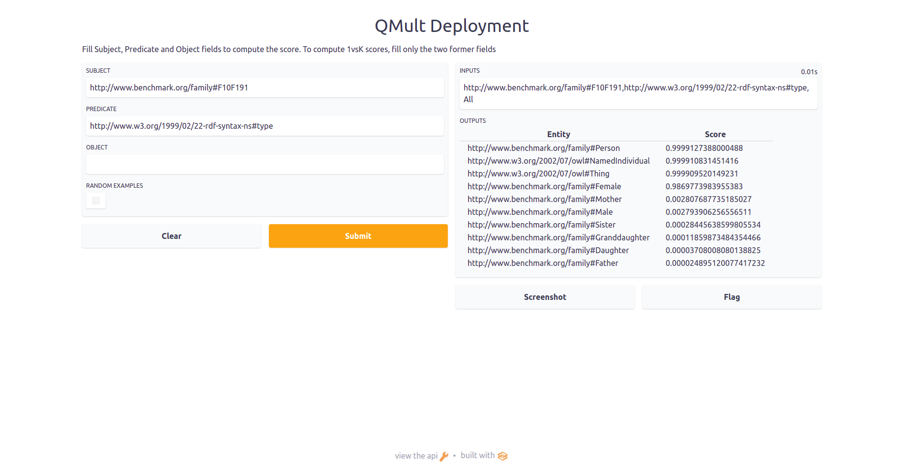

# Knowledge Graph Embeddings at Scale

This open-source project is designed to ease real-world applications of knowledge graph embeddings. 
Wit this aim, we apply rely on
1. [DASK](https://dask.org/) to use multi-CPUs at preprocessing a large knowledge graph,
2. [PytorchLightning](https://www.pytorchlightning.ai/) to learn knowledge graph embeddings via multi-CPUs, GPUs, TPUs or  computing cluster, and
3. [Gradio](https://gradio.app/) to ease the deployment of pre-trained models.

### Installation
Clone the repository:
```
git clone https://github.com/dice-group/DAIKIRI-Embedding.git
```
Install dependencies via conda:
```
conda env create -f environment.yml
conda activate daikiri
```
or via pip:
```
# ensure that python 3.9 is available
pip install -r requirements.txt
```
or manually
```
conda create -n daikiri python=3.9
conda activate daikiri
pip install torch==1.10.1+cu113 -f https://download.pytorch.org/whl/cu113/torch_stable.html
pip install pytorch-lightning==1.5.9
pip install "dask[complete]"==2022.1.0
pip install scikit-learn==1.0.2
pip install pytest==6.2.5
pip install gradio==2.7.5.2
pip install pyarrow==6.0.1
```
To test the Installation
```
wget https://hobbitdata.informatik.uni-leipzig.de/KG/KGs.zip
unzip KGs.zip
pytest -p no:warnings
```
# Deployment and Open-sourcing
Any pretrained model can be deployed with an ease. Moreover, anyone on the internet can use the pretrained model with ```--share``` parameter.
```
python deploy.py --path_of_experiment_folder 'DAIKIRI_Storage/QMultFamily' --share
Loading Model...
Model is loaded!
Running on local URL:  http://127.0.0.1:7860/
Running on public URL: https://54886.gradio.app

This share link expires in 72 hours. For free permanent hosting, check out Spaces (https://huggingface.co/spaces)
```


## Pre-trained Models
Please contact:  ```caglar.demir@upb.de ``` or ```caglardemir8@gmail.com ``` , if you lack hardware resources to obtain embeddings of a specific knowledge Graph.
- [DBpedia version: 03-2021 Embeddings](https://hobbitdata.informatik.uni-leipzig.de/KGE/DBpediaQMultEmbeddings):
  - 114,747,963 entities, 13,906 relations, and 375,900,264 triples.
- [YAGO3-10 ConEx embeddings](https://hobbitdata.informatik.uni-leipzig.de/KGE/conex/YAGO3-10.zip)
- [FB15K-237 ConEx embeddings](https://hobbitdata.informatik.uni-leipzig.de/KGE/conex/FB15K-237.zip)
- [FB15K ConEx embeddings](https://hobbitdata.informatik.uni-leipzig.de/KGE/conex/FB15K.zip)
- [WN18RR ConEx embeddings](https://hobbitdata.informatik.uni-leipzig.de/KGE/conex/WN18RR.zip)
- [WN18 ConEx embeddings](https://hobbitdata.informatik.uni-leipzig.de/KGE/conex/WN18.zip)
- [Hepatitis ConEx embeddings](https://hobbitdata.informatik.uni-leipzig.de/KGE/conex/ConEx_Hepatitis.zip)
- [Lymphography ConEx embeddings](https://hobbitdata.informatik.uni-leipzig.de/KGE/conex/ConEx_Lymphography.zip)
- [Mammographic ConEx embeddings](https://hobbitdata.informatik.uni-leipzig.de/KGE/conex/ConEx_Mammographic.zip)
- For more please look at [Hobbit Data](https://hobbitdata.informatik.uni-leipzig.de/KGE/)

### Available Models
1. Multiplicative based KGE models: [DistMult](https://arxiv.org/pdf/1412.6575.pdf), [ComplEx](https://arxiv.org/pdf/1606.06357.pdf), [QMult](https://proceedings.mlr.press/v157/demir21a.html), and [OMult](https://proceedings.mlr.press/v157/demir21a.html) 
2. Feed Forward Neural Models: [Shallom](https://arxiv.org/pdf/2101.09090.pdf)
3. Convolutional Neural models [ConEx](https://openreview.net/forum?id=6T45-4TFqaX&invitationId=eswc-conferences.org/ESWC/2021/Conference/Research_Track/Paper49/-/Camera_Ready_Revision&referrer=%5BTasks%5D(%2Ftasks)), [ConvQ](https://proceedings.mlr.press/v157/demir21a.html), [ConvO](https://proceedings.mlr.press/v157/demir21a.html)
4. Contact us to add your favorite one :)

### Knowledge Graphs Format
1. A dataset must be located in a folder, e.g. 'KGs/YAGO3-10'.
2. A folder must contain **train** file. If the validation and test splits are available, then they must named as **valid** and **test**, respectively.
3. **train**, **valid** and **test** must be in either [N-triples](https://www.w3.org/2001/sw/RDFCore/ntriples/) format or standard link prediction dataset format (see KGs folder).
4. **train**, **valid** and **test** contain more than 10^7 triples, you may want to split each file, e.g.,
```
split train.txt -l 100000 train_split
mv train.txt orignal_train.txt
```
This would allow to fully leverage DASK as DASK allow us to read separate files simultaneously

5. Larger **train**, **valid**, and **test** can be stored in any of the following compression techniques [.gz, .bz2, or .zip].
Splitting a large **train.gz** into **train1.gz**, **train2.gz** etc. often decreases the runtimes of reading as in (4)

### Training
1. o obtain Shallom embeddings ([Research paper](https://arxiv.org/abs/2101.09090) and [conference presentation](https://www.youtube.com/watch?v=LUDpdgdvTQg)) 
```python main.py --path_dataset_folder "KGs/Family" --model "Shallom" --num_folds_for_cv 10 --num_epochs 1```
This execution results in generating **Mean and standard deviation of raw MRR in 10-fold cross validation => 0.768, 0.023**. Moreover, all necessary information including embeddings are stored in DAIKIRI_Storage folder (if does not exist it will be created).
2. Most link prediction benchmark datasets contain the train, validation and test datasets (see 'KGs/FB15K-237', 'KGs/WN18RR' or 'KGs/YAGO3-10').
To evaluate quality of embeddings, we rely on the standard metric, i.e. mean reciprocal rank (MRR). Executing ```python main.py --path_dataset_folder "KGs/WN18RR" --model "QMult" --num_epochs 1 --scoring_technique "KvsAll" ```
results in evaluating quality of SHALLOM embeddings on the test split.

### Example Commands

1. To train our approaches for 10 epochs by using all available CPUs on UMLS. 
```
python main.py --path_dataset_folder "KGs/UMLS" --model "ConEx" --num_epochs 10 --scoring_technique "KvsAll"
```
2. To train our approaches for 10 epochs by using a single GPU.
```
python main.py --gpus 1 --path_dataset_folder "KGs/UMLS" --model "DistMult" --num_epochs 10 --scoring_technique "KvsAll"
python main.py --gpus 1 --path_dataset_folder "KGs/UMLS" --model "ComplEx" --num_epochs 10 --scoring_technique "KvsAll"
```

3. To train Shallom for 1 epochs on UMLS. All information will be stored in to 'DummyFolder'.
```
python main.py --gpus 1 --path_dataset_folder 'KGs/UMLS' --storage_path "DummyFolder" --model "ComplEx" --num_epochs 10 --scoring_technique "1vsAll"
```

4. To train Shallom on Carcinogenesis by using 10-fold cross validation on Carcinogenesis.  To check GPU usages, ```watch -n 1 nvidia-smi```
```
python main.py --gpus 1 --path_dataset_folder "KGs/Carcinogenesis" --model "Shallom" --num_folds_for_cv 10 --num_epochs 10
```
5. Train Shallom for 5 epochs by using **8 GPUs** on WN18RR To check GPU usages, ```watch -n 1 nvidia-smi```.
```
python main.py --gpus 8 --distributed_backend ddp --path_dataset_folder "KGs/WN18RR" --model 'Shallom' --num_epochs 5
```
6. More examples can be found in run.sh.

## How to cite
If you really liked our work :), feel free to cite 
```
# QMult, OMult, ConvQ, ConvO
@InProceedings{pmlr-v157-demir21a,
  title = 	 {Convolutional Hypercomplex Embeddings for Link Prediction},
  author =       {Demir, Caglar and Moussallem, Diego and Heindorf, Stefan and Ngonga Ngomo, Axel-Cyrille},
  booktitle = 	 {Proceedings of The 13th Asian Conference on Machine Learning},
  pages = 	 {656--671},
  year = 	 {2021},
  editor = 	 {Balasubramanian, Vineeth N. and Tsang, Ivor},
  volume = 	 {157},
  series = 	 {Proceedings of Machine Learning Research},
  month = 	 {17--19 Nov},
  publisher =    {PMLR},
  pdf = 	 {https://proceedings.mlr.press/v157/demir21a/demir21a.pdf},
  url = 	 {https://proceedings.mlr.press/v157/demir21a.html},
}

# ConEx
@inproceedings{demir2021convolutional,
title={Convolutional Complex Knowledge Graph Embeddings},
author={Caglar Demir and Axel-Cyrille Ngonga Ngomo},
booktitle={Eighteenth Extended Semantic Web Conference - Research Track},
year={2021},
url={https://openreview.net/forum?id=6T45-4TFqaX}}

# Shallom
@inproceedings{demir2021shallow,
  title={A shallow neural model for relation prediction},
  author={Demir, Caglar and Moussallem, Diego and Ngomo, Axel-Cyrille Ngonga},
  booktitle={2021 IEEE 15th International Conference on Semantic Computing (ICSC)},
  pages={179--182},
  year={2021},
  organization={IEEE}
```
For any questions or wishes, please contact:  ```caglar.demir@upb.de``` or ```caglardemir8@gmail.com.de```

