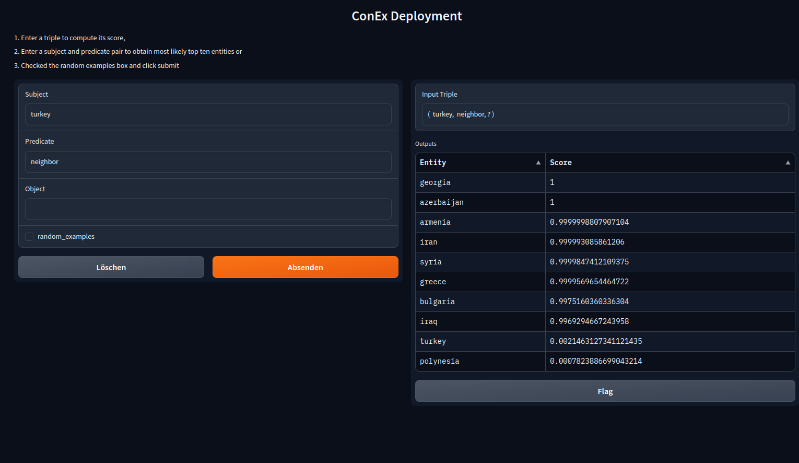

[](https://pepy.tech/project/dicee)
[](https://pypi.org/project/dicee/)
[](https://dice-group.github.io/dice-embeddings/usage/main.html#coverage-report)
[](https://pypi.org/project/dicee/0.2.0/)
[](https://dice-group.github.io/dice-embeddings/index.html)
[](https://deepwiki.com/dice-group/dice-embeddings)


# DICE Embeddings: Hardware-agnostic Framework for Large-scale Knowledge Graph Embeddings

Knowledge graph embedding research has mainly focused on learning continuous representations of knowledge graphs towards the link prediction problem. 
Recently developed frameworks can be effectively applied in a wide range of research-related applications.
Yet, using these frameworks in real-world applications becomes more challenging as the size of the knowledge graph grows.

We developed the DICE Embeddings framework (dicee) to compute embeddings for large-scale knowledge graphs in a hardware-agnostic manner.
To achieve this goal, we rely on
1. **[Pandas](https://pandas.pydata.org/) & Co.** to use parallelism at preprocessing a large knowledge graph,
2. **[PyTorch](https://pytorch.org/) & Co.** to learn knowledge graph embeddings via multi-CPUs, GPUs, TPUs or computing cluster, and
3. **[Huggingface](https://huggingface.co/)** to ease the deployment of pre-trained models.

**Why [Pandas](https://pandas.pydata.org/) & Co. ?**
A large knowledge graph can be read and preprocessed (e.g. removing literals) by pandas, modin, or polars in parallel.
Through polars, a knowledge graph having more than 1 billion triples can be read in parallel fashion. 
Importantly, using these frameworks allow us to perform all necessary computations on a single CPU as well as a cluster of computers.

**Why [PyTorch](https://pytorch.org/) & Co. ?**
PyTorch is one of the most popular machine learning frameworks available at the time of writing. 
PytorchLightning facilitates scaling the training procedure of PyTorch without boilerplate.
In our framework, we combine [PyTorch](https://pytorch.org/) & [PytorchLightning](https://www.pytorchlightning.ai/).
Users can choose the trainer class (e.g., DDP by Pytorch) to train large knowledge graph embedding models with billions of parameters.
PytorchLightning allows us to use state-of-the-art model parallelism techniques (e.g. Fully Sharded Training, FairScale, or DeepSpeed)
without extra effort.
With our framework, practitioners can directly use PytorchLightning for model parallelism to train gigantic embedding models.

**Why [Hugging-face Gradio](https://huggingface.co/gradio)?**
Deploy a pre-trained embedding model without writing a single line of code.

## For more please visit [dice-embeddings](https://dice-group.github.io/dice-embeddings/)!

## Installation
<details><summary> Click me! </summary>

### Installation from Source
``` bash
git clone https://github.com/dice-group/dice-embeddings.git
conda create -n dice python=3.10.13 --no-default-packages && conda activate dice && pip3 install -e .
# or
pip3 install -e .["dev"]
```
or
```bash
pip install dicee
```
## Download Knowledge Graphs
```bash
wget https://files.dice-research.org/datasets/dice-embeddings/KGs.zip --no-check-certificate && unzip KGs.zip
```
To test the Installation
```bash
python -m pytest -p no:warnings -x # Runs >119 tests leading to > 15 mins
python -m pytest -p no:warnings --lf # run only the last failed test
python -m pytest -p no:warnings --ff # to run the failures first and then the rest of the tests.
```

</details>

## Knowledge Graph Embedding Models
<details> <summary> To see available Models</summary>

* ```--model Decal | Keci | DualE | ComplEx | QMult | OMult | ConvQ | ConvO | ConEx | TransE | DistMult | Shallom```
* ```--model Pykeen_QuatE | Pykeen_Mure ``` all embedding models available in https://github.com/pykeen/pykeen#models can be selected.

Training and scoring techniques
* ```--trainer torchCPUTrainer | PL | MP | torchDDP ```
* ```--scoring_technique 1vsAll | KvsAll  | AllvsAll | KvsSample | NegSample ```

</details>

## How to Train
<details> <summary> To see a code snippet </summary>

#### Training Techniques

A KGE model can be trained with a state-of-the-art training technique ```--trainer "torchCPUTrainer" | "PL" | "MP" | torchDDP ```
```bash
# CPU training
dicee --dataset_dir "KGs/UMLS" --trainer "torchCPUTrainer" --scoring_technique KvsAll --model "Keci" --eval_model "train_val_test"
# Distributed Data Parallelism
dicee --dataset_dir "KGs/UMLS" --trainer "PL" --scoring_technique KvsAll --model "Keci" --eval_model "train_val_test"
# Model Parallelism
dicee --dataset_dir "KGs/UMLS" --trainer "MP" --scoring_technique KvsAll --model "Keci" --eval_model "train_val_test"
# Distributed Data Parallelism in native torch
OMP_NUM_THREADS=1 torchrun --standalone --nnodes=1 --nproc_per_node=gpu dicee --dataset_dir "KGs/UMLS" --model Keci --eval_model "train_val_test" --trainer "torchDDP" --scoring_technique KvsAll
```
A KGE model model can also be trained in multi-node multi-gpu DDP setting. 
```bash
torchrun --nnodes 2 --nproc_per_node=gpu  --node_rank 0 --rdzv_id 455 --rdzv_backend c10d --rdzv_endpoint=nebula  dicee --trainer "torchDDP" --dataset_dir "KGs/YAGO3-10"
torchrun --nnodes 2 --nproc_per_node=gpu  --node_rank 1 --rdzv_id 455 --rdzv_backend c10d --rdzv_endpoint=nebula  dicee --trainer "torchDDP" --dataset_dir "KGs/YAGO3-10"
```
On large knowledge graphs, this configurations should be used.

where the data is in the following form
```bash
$ head -3 KGs/UMLS/train.txt 
acquired_abnormality    location_of     experimental_model_of_disease
anatomical_abnormality  manifestation_of        physiologic_function
alga    isa     entity

$ head -3 KGs/YAGO3-10/valid.txt 
Mikheil_Khutsishvili    playsFor        FC_Merani_Tbilisi
Ebbw_Vale       isLocatedIn     Blaenau_Gwent
Valenciennes    isLocatedIn     Nord-Pas-de-Calais
```
By default, ```--backend "pandas" --separator "\s+" ``` is used in ```pandas.read_csv(sep=args.separator)``` to obtain triples.
You can choose a suitable backend for your knowledge graph ```--backend pandas | polars  | rdflib ```.
On large knowledge graphs n-triples, ```--backend "polars" --separator " " ``` is a good option.
**Apart from n-triples or standard link prediction dataset formats, we support ["owl", "nt", "turtle", "rdf/xml", "n3"]***.
On other RDF knowledge graphs,  ```--backend "rdflib" ``` can be used. Note that knowledge graphs must not contain blank nodes or literals.
Moreover, a KGE model can be also trained  by providing **an endpoint of a triple store**. 
```bash
dicee --sparql_endpoint "http://localhost:3030/mutagenesis/" --model Keci
```

#### Scoring Techniques

We have implemented state-of-the-art scoring techniques to train a KGE model ```--scoring_technique 1vsAll | KvsAll  | AllvsAll | KvsSample | NegSample ```.
```bash
dicee --dataset_dir "KGs/YAGO3-10" --model Keci --trainer "torchCPUTrainer" --scoring_technique "NegSample" --neg_ratio 10 --num_epochs 10 --batch_size 10_000 --num_core 0 --eval_model None
# Epoch:10: 100%|███████████| 10/10 [01:31<00:00,  9.11s/it, loss_step=0.09423, loss_epoch=0.07897]
# Training Runtime: 1.520 minutes.
dicee --dataset_dir "KGs/YAGO3-10" --model Keci --trainer "torchCPUTrainer" --scoring_technique "NegSample" --neg_ratio 10 --num_epochs 10 --batch_size 10_000 --num_core 10 --eval_model None
# Epoch:10: 100%|███████████| 10/10 [00:58<00:00,  5.80s/it, loss_step=0.11909, loss_epoch=0.07991]
# Training Runtime: 58.106 seconds.
dicee --dataset_dir "KGs/YAGO3-10" --model Keci --trainer "torchCPUTrainer" --scoring_technique "NegSample" --neg_ratio 10 --num_epochs 10 --batch_size 10_000 --num_core 20 --eval_model None
# Epoch:10: 100%|███████████| 10/10 [01:01<00:00,  6.16s/it, loss_step=0.10751, loss_epoch=0.06962]
# Training Runtime: 1.029 minutes.
dicee --dataset_dir "KGs/YAGO3-10" --model Keci --trainer "torchCPUTrainer" --scoring_technique "NegSample" --neg_ratio 10 --num_epochs 10 --batch_size 10_000 --num_core 50 --eval_model None
# Epoch:10: 100%|███████████| 10/10 [01:08<00:00,  6.83s/it, loss_step=0.05347, loss_epoch=0.07003]
# Training Runtime: 1.140 minutes.
```
Increasing the number of cores often (but not always) helps to decrease the runtimes on large knowledge graphs ```--num_core 4 --scoring_technique KvsSample | NegSample --neg_ratio 1``` 

A KGE model can be also trained in a python script
```python
from dicee.executer import Execute
from dicee.config import Namespace
args = Namespace()
args.model = 'Keci'
args.scoring_technique = "KvsAll"  # 1vsAll, or AllvsAll, or NegSample
args.dataset_dir = "KGs/UMLS"
args.path_to_store_single_run = "Keci_UMLS"
args.num_epochs = 100
args.embedding_dim = 32
args.batch_size = 1024
reports = Execute(args).start()
print(reports["Train"]["MRR"]) # => 0.9912
print(reports["Test"]["MRR"]) # => 0.8155
# See the Keci_UMLS folder embeddings and all other files
```

#### Continual Learning

Train a KGE model by providing the path of a single file and store all parameters under newly created directory
called `KeciFamilyRun`.
```bash
dicee --path_single_kg "KGs/Family/family-benchmark_rich_background.owl" --model Keci --path_to_store_single_run KeciFamilyRun --backend rdflib --eval_model None
```
where the data is in the following form
```bash
$ head -3 KGs/Family/train.txt 
_:1 <http://www.w3.org/1999/02/22-rdf-syntax-ns#type> <http://www.w3.org/2002/07/owl#Ontology> .
<http://www.benchmark.org/family#hasChild> <http://www.w3.org/1999/02/22-rdf-syntax-ns#type> <http://www.w3.org/2002/07/owl#ObjectProperty> .
<http://www.benchmark.org/family#hasParent> <http://www.w3.org/1999/02/22-rdf-syntax-ns#type> <http://www.w3.org/2002/07/owl#ObjectProperty> .
```

**Continual Training:** the training phase of a pretrained model can be resumed. The model will saved in the same directory ``` --continual_learning "KeciFamilyRun"```.
```bash
dicee --continual_learning "KeciFamilyRun" --path_single_kg "KGs/Family/family-benchmark_rich_background.owl" --model Keci --backend rdflib --eval_model None
```
#### Single device training on Multi-Device setup

When using a multi-GPU setup, `PL` Trainer  automatically utilizes all available CUDA devices. To perform training on a single device, set the environment variable `CUDA_VISIBLE_DEVICES=0` before running your command. For example:

```bash
CUDA_VISIBLE_DEVICES=0 dicee --dataset_dir "KGs/UMLS" --trainer "PL" --scoring_technique KvsAll --model "Keci" --eval_model "train_val_test" --num_epochs 100
``` 
The `CUDA_VISIBLE_DEVICES=0` setting limits the program to access only the specified GPU(s), making all others invisible.  
Multiple GPUs can be selected by providing a comma-separated list, for example: `CUDA_VISIBLE_DEVICES=0,1`.

</details>

## Search and Retrieval via Qdrant Vector Database

<details> <summary> To see a code snippet </summary>

```bash
# Train an embedding model
dicee --dataset_dir KGs/Countries-S1 --path_to_store_single_run CountryEmbeddings --model Keci --p 0 --q 1 --embedding_dim 256 --scoring_technique AllvsAll --num_epochs 300 --save_embeddings_as_csv
```
Start qdrant instance.

```bash
pip3 install fastapi uvicorn qdrant-client
docker pull qdrant/qdrant && docker run -p 6333:6333 -p 6334:6334      -v $(pwd)/qdrant_storage:/qdrant/storage:z      qdrant/qdrant
```
Upload Embeddings into vector database and start a webservice
```bash
dicee_vector_db --index --serve --path CountryEmbeddings --collection "countries_vdb"
Creating a collection countries_vdb with distance metric:Cosine
Completed!
INFO:     Started server process [28953]
INFO:     Waiting for application startup.
INFO:     Application startup complete.
INFO:     Uvicorn running on http://0.0.0.0:8000 (Press CTRL+C to quit)
```
Retrieve an embedding vector.
```bash
curl -X 'GET' 'http://0.0.0.0:8000/api/get?q=germany' -H 'accept: application/json'
# {"result": [{"name": "europe","vector": [...]}]}
```
Retrieve embedding vectors.
```bash
curl -X 'POST' 'http://0.0.0.0:8000/api/search_batch' -H 'accept: application/json' -H 'Content-Type: application/json' -d '{"queries": ["brunei","guam"]}'
# {"results": [{ "name": "europe","vector": [...]},{ "name": "northern_europe","vector": [...]}]}    
```
Retrieve an average of embedding vectors.
```bash
curl -X 'POST' 'http://0.0.0.0:8000/api/search_batch' -H 'accept: application/json' -H 'Content-Type: application/json' -d '{"queries": ["europe","northern_europe"],"reducer": "mean"}'
# {"results":{"name": ["europe","northern_europe"],"vectors": [...]}}
```

</details>


## Answering Complex Queries 
<details> <summary> To see a code snippet </summary>

```python
# pip install dicee
# wget https://files.dice-research.org/datasets/dice-embeddings/KGs.zip --no-check-certificate & unzip KGs.zip
from dicee.executer import Execute
from dicee.config import Namespace
from dicee.knowledge_graph_embeddings import KGE
# (1) Train a KGE model
args = Namespace()
args.model = 'Keci'
args.p=0
args.q=1
args.optim = 'Adam'
args.scoring_technique = "AllvsAll"
args.path_single_kg = "KGs/Family/family-benchmark_rich_background.owl"
args.backend = "rdflib"
args.num_epochs = 200
args.batch_size = 1024
args.lr = 0.1
args.embedding_dim = 512
result = Execute(args).start()
# (2) Load the pre-trained model
pre_trained_kge = KGE(path=result['path_experiment_folder'])
# (3) Single-hop query answering
# Query: ?E : \exist E.hasSibling(E, F9M167)
# Question: Who are the siblings of F9M167?
# Answer: [F9M157, F9F141], as (F9M167, hasSibling, F9M157) and (F9M167, hasSibling, F9F141)
predictions = pre_trained_kge.answer_multi_hop_query(query_type="1p",
                                                     query=('http://www.benchmark.org/family#F9M167',
                                                            ('http://www.benchmark.org/family#hasSibling',)),
                                                     tnorm="min", k=3)
top_entities = [topk_entity for topk_entity, query_score in predictions]
assert "http://www.benchmark.org/family#F9F141" in top_entities
assert "http://www.benchmark.org/family#F9M157" in top_entities
# (2) Two-hop query answering
# Query: ?D : \exist E.Married(D, E) \land hasSibling(E, F9M167)
# Question: To whom a sibling of F9M167 is married to?
# Answer: [F9F158, F9M142] as (F9M157 #married F9F158) and (F9F141 #married F9M142)
predictions = pre_trained_kge.answer_multi_hop_query(query_type="2p",
                                                     query=("http://www.benchmark.org/family#F9M167",
                                                            ("http://www.benchmark.org/family#hasSibling",
                                                             "http://www.benchmark.org/family#married")),
                                                     tnorm="min", k=3)
top_entities = [topk_entity for topk_entity, query_score in predictions]
assert "http://www.benchmark.org/family#F9M142" in top_entities
assert "http://www.benchmark.org/family#F9F158" in top_entities
# (3) Three-hop query answering
# Query: ?T : \exist D.type(D,T) \land Married(D,E) \land hasSibling(E, F9M167)
# Question: What are the type of people who are married to a sibling of F9M167?
# (3) Answer: [Person, Male, Father] since  F9M157 is [Brother Father Grandfather Male] and F9M142 is [Male Grandfather Father]

predictions = pre_trained_kge.answer_multi_hop_query(query_type="3p", query=("http://www.benchmark.org/family#F9M167",
                                                                             ("http://www.benchmark.org/family#hasSibling",
                                                                             "http://www.benchmark.org/family#married",
                                                                             "http://www.w3.org/1999/02/22-rdf-syntax-ns#type")),
                                                     tnorm="min", k=5)
top_entities = [topk_entity for topk_entity, query_score in predictions]
print(top_entities)
assert "http://www.benchmark.org/family#Person" in top_entities
assert "http://www.benchmark.org/family#Father" in top_entities
assert "http://www.benchmark.org/family#Male" in top_entities
```
For more, please refer to `examples/multi_hop_query_answering`.
</details>

## Predicting Missing Links
<details> <summary> To see a code snippet</summary>

```python
from dicee import KGE
# (1) Train a knowledge graph embedding model..
# (2) Load a pretrained model
pre_trained_kge = KGE(path='..')
# (3) Predict missing links through head entity rankings
pre_trained_kge.predict_topk(h=[".."],r=[".."],topk=10)
# (4) Predict missing links through relation rankings
pre_trained_kge.predict_topk(h=[".."],t=[".."],topk=10)
# (5) Predict missing links through tail entity rankings
pre_trained_kge.predict_topk(r=[".."],t=[".."],topk=10)
```

</details>

## Literal Prediction using Pre-trained KGE
<details> <summary> To see a code snippet</summary>

```python
from dicee import KGE
# (1) Train a knowledge graph embedding model..
# (2) Load a pretrained model
pre_trained_kge = KGE(path='..')
# (3) Train a literal Emebedding Model using interactive KGE
pre_trained_kge.train_literals(train_file_path = "")
# (4) Predict Literal value for Entity-Attribute pair
pre_trained_kge.predict_literals(entity=[".."],attribute=[".."])
```
A detailed illustration and explanation of literal prediction is provided in `examples/KGE_literal_prediction.ipynb`.

</details>

## Downloading Pretrained Models 

We provide plenty pretrained knowledge graph embedding models at [dice-research.org/projects/DiceEmbeddings/](https://files.dice-research.org/projects/DiceEmbeddings/).
<details> <summary> To see a code snippet </summary>

```python
from dicee import KGE
mure = KGE(url="https://files.dice-research.org/projects/DiceEmbeddings/YAGO3-10-Pykeen_MuRE-dim128-epoch256-KvsAll")
quate = KGE(url="https://files.dice-research.org/projects/DiceEmbeddings/YAGO3-10-Pykeen_QuatE-dim128-epoch256-KvsAll")
keci = KGE(url="https://files.dice-research.org/projects/DiceEmbeddings/YAGO3-10-Keci-dim128-epoch256-KvsAll")
quate.predict_topk(h=["Mongolia"],r=["isLocatedIn"],topk=3)
# [('Asia', 0.9894362688064575), ('Europe', 0.01575559377670288), ('Tadanari_Lee', 0.012544365599751472)]
keci.predict_topk(h=["Mongolia"],r=["isLocatedIn"],topk=3)
# [('Asia', 0.6522021293640137), ('Chinggis_Khaan_International_Airport', 0.36563414335250854), ('Democratic_Party_(Mongolia)', 0.19600993394851685)]
mure.predict_topk(h=["Mongolia"],r=["isLocatedIn"],topk=3)
# [('Asia', 0.9996906518936157), ('Ulan_Bator', 0.0009907372295856476), ('Philippines', 0.0003116439620498568)]
```

</details>

## How to Deploy
<details> <summary> To see a single line of code</summary>

```python
from dicee import KGE
KGE(path='...').deploy(share=True,top_k=10)
```

</details>

<details> <summary> To see the interface of the webservice</summary>

</details>


## Link Prediction Benchmarks

In the below, we provide a brief overview of the link prediction results. Results are sorted in descending order of the size of the respective dataset.

#### YAGO3-10 ####

<details> <summary> To see the results </summary>

|                    |       |   MRR | Hits@1 | Hits@3 | Hits@10 |
|--------------------|-------|------:|-------:|-------:|--------:|
| ComplEx-KvsAll     | train | 1.000 |  1.000 |  1.000 |   1.000 |
| ComplEx-KvsAll     | val   | 0.374 |  0.308 |  0.402 |   0.501 |
| ComplEx-KvsAll     | test  | 0.372 |  0.302 |  0.404 |   0.505 |
| ComplEx-KvsAll-SWA | train | 0.998 |  0.997 |  1.000 |   1.000 |
| ComplEx-KvsAll-SWA | val   | 0.345 |  0.279 |  0.372 |   0.474 |
| ComplEx-KvsAll-SWA | test  | 0.341 |  0.272 |  0.374 |   0.474 |
| ComplEx-KvsAll-ASWA | train | 1.000 |  1.000 |  1.000 |   1.000 |
| ComplEx-KvsAll-ASWA | val   | 0.404 |  0.335 |  0.448 |   0.531 |
| ComplEx-KvsAll-ASWA | test  | 0.398 |  0.325 |  0.449 |   0.530 |
| Keci-KvsAll        | train | 1.000 |  1.000 |  1.000 |   1.000 |
| Keci-KvsAll        | val   | 0.337 |  0.268 |  0.370 |   0.468 |
| Keci-KvsAll        | test  | 0.343 |  0.274 |  0.376 |   0.343 |
| Keci-KvsAll-SWA    | train | 1.000 |  1.000 |  1.000 |   1.000 |
| Keci-KvsAll-SWA    | val   | 0.325 |  0.253 |  0.358 |   0.459 |
| Keci-KvsAll-SWA    | test  | 0.334 |  0.263 |  0.367 |   0.470 |
| Keci-KvsAll-ASWA   | train | 0.978 |  0.969 |  0.985 |   0.991 |
| Keci-KvsAll-ASWA   | val   | 0.400 |  0.324 |  0.439 |   0.540 |
| Keci-KvsAll-ASWA   | test  | 0.394 |  0.317 |  0.439 |   0.539 |

```--embedding_dim 256 --num_epochs 300 --batch_size 1024 --optim Adam 0.1``` leading to 31.6M params.
Observations: A severe overfitting. ASWA improves the generalization better than SWA.

</details>

#### FB15k-237 ####

<details> <summary> To see the results </summary>

|                    |       |   MRR | Hits@1 | Hits@3 | Hits@10 |
|--------------------|-------|------:|-------:|-------:|--------:|
| ComplEx-KvsAll     | train | 1.000 |  1.000 |  1.000 |   1.000 |
| ComplEx-KvsAll     | val   | 0.197 |  0.140 |  0.211 |   0.307 |
| ComplEx-KvsAll     | test  | 0.192 |  0.137 |  0.204 |   0.300 |
| ComplEx-KvsAll-SWA | train | 0.911 |  0.875 |  0.938 |   0.970 |
| ComplEx-KvsAll-SWA | val   | 0.169 |  0.121 |  0.178 |   0.264 |
| ComplEx-KvsAll-SWA | test  | 0.166 |  0.118 |  0.176 |   0.261 |
| ComplEx-KvsAll-ASWA | train | 0.780 | 0.719 | 0.822  |   0.886 |
| ComplEx-KvsAll-ASWA | val   | 0.220 | 0.158 | 0.240  |   0.342 |
| ComplEx-KvsAll-ASWA | test  | 0.217 | 0.155 |  0.234 |   0.337 |
| Keci-KvsAll        | train | 1.000 |  1.000 |  1.000 |   1.000 |
| Keci-KvsAll        | val   | 0.158 |  0.107 |  0.166 |   0.259 |
| Keci-KvsAll        | test  | 0.155 |  0.105 |  0.162 |   0.253 |
| Keci-KvsAll-SWA    | train | 0.941 |  0.909 |  0.967 |   0.990 |
| Keci-KvsAll-SWA    | val   | 0.188 |  0.133 |  0.200 |   0.298 |
| Keci-KvsAll-SWA    | test  | 0.183 |  0.128 |  0.195 |   0.292 |
| Keci-KvsAll-ASWA   | train | 0.745 |  0.666 |  0.799 |   0.886 |
| Keci-KvsAll-ASWA   | val   | 0.221 |  0.158 |  0.237 |   0.346 |
| Keci-KvsAll-ASWA   | test  | 0.216 |  0.153 |  0.233 |   0.342 |

</details>


#### WN18RR ####

<details> <summary> To see the results </summary>

|                    |       |   MRR | Hits@1 | Hits@3 | Hits@10 |
|--------------------|-------|------:|-------:|-------:|--------:|
| ComplEx-KvsAll     | train | 1.000 |  1.000 |  1.000 |   1.000 |
| ComplEx-KvsAll     | val   | 0.346 |  0.337 |  0.353 |   0.359 |
| ComplEx-KvsAll     | test  | 0.343 |  0.333 |  0.349 |   0.357 |
| ComplEx-KvsAll-SWA | train | 0.335 |  0.242 |  0.365 |   0.522 |
| ComplEx-KvsAll-SWA | val   | 0.014 |  0.004 |  0.013 |   0.029 |
| ComplEx-KvsAll-SWA | test  | 0.018 |  0.007 |  0.017 |   0.036 |
| ComplEx-KvsAll-ASWA | train | 0.999 | 0.999 | 0.999  |   0.999 |
| ComplEx-KvsAll-ASWA | val   | 0.352 | 0.348 | 0.355  |   0.359 |
| ComplEx-KvsAll-ASWA | test  | 0.348 | 0.342 |  0.351 |   0.355 |
| Keci-KvsAll        | train | 1.000 |  1.000 |  1.000 |   1.000 |
| Keci-KvsAll        | val   | 0.316 |  0.296 |  0.331 |   0.352 |
| Keci-KvsAll        | test  | 0.308 |  0.285 |  0.326 |   0.346 |
| Keci-KvsAll-SWA    | train | 0.608 |  0.516 |  0.657 |   0.787 |
| Keci-KvsAll-SWA    | val   | 0.069 |  0.038 |  0.073 |   0.130 |
| Keci-KvsAll-SWA    | test  | 0.061 |  0.032 |  0.064 |   0.119 |
| Keci-KvsAll-ASWA   | train | 0.951 |  0.916 |  0.985 |   0.997 |
| Keci-KvsAll-ASWA   | val   | 0.356 |  0.353 |  0.356 |   0.360 |
| Keci-KvsAll-ASWA   | test  | 0.350 |  0.347 |  0.350 |   0.355 |

</details>

#### UMLS ####

<details> <summary> To see the results </summary>

|                       |       |   MRR | Hits@1 | Hits@3 | Hits@10 |
|-----------------------|-------|------:|-------:|-------:|--------:|
| ComplEx-KvsAll        | train | 1.000 |  1.000 |  1.000 |   1.000 |
| ComplEx-KvsAll        | val   | 0.684 |  0.557 |  0.771 |   0.928 |
| ComplEx-KvsAll        | test  | 0.680 |  0.563 |  0.750 |   0.918 |
| ComplEx-AllvsAll      | train | 1.000 |  1.000 |  1.000 |   1.000 |
| ComplEx-AllvsAll      | val   | 0.771 |  0.670 |  0.847 |   0.949 |
| ComplEx-AllvsAll      | test  | 0.778 |  0.678 |  0.850 |   0.957 |
| ComplEx-KvsAll-SWA    | train | 1.000 |  1.000 |  1.000 |   1.000 |
| ComplEx-KvsAll-SWA    | val   | 0.762 |  0.666 |  0.825 |   0.941 |
| ComplEx-KvsAll-SWA    | test  | 0.757 |  0.653 |  0.833 |   0.939 |
| ComplEx-AllvsAll-SWA  | train | 1.000 |  1.000 |  1.000 |   1.000 |
| ComplEx-AllvsAll-SWA  | val   | 0.817 |  0.736 |  0.879 |   0.953 |
| ComplEx-AllvsAll-SWA  | test  | 0.827 |  0.748 |  0.883 |   0.967 |
| ComplEx-KvsAll-ASWA   | train | 0.998 |  0.997 |  0.999 |   1.000 |
| ComplEx-KvsAll-ASWA   | val   | 0.799 |  0.712 |  0.863 |   0.946 |
| ComplEx-KvsAll-ASWA   | test  | 0.804 |  0.720 |  0.866 |   0.948 |
| ComplEx-AllvsAll-ASWA | train | 0.998 |  0.997 |  0.998 |   0.999 |
| ComplEx-AllvsAll-ASWA | val   | 0.879 |  0.824 |  0.926 |   0.964 |
| ComplEx-AllvsAll-ASWA | test  | 0.877 |  0.819 |  0.924 |   0.971 |
| Keci-KvsAll           | train | 1.000 |  1.000 |  1.000 |   1.000 |
| Keci-KvsAll           | val   | 0.538 |  0.401 |  0.595 |   0.829 |
| Keci-KvsAll           | test  | 0.543 |  0.411 |  0.610 |   0.815 |
| Keci-AllvsAll         | train | 1.000 |  1.000 |  1.000 |   1.000 |
| Keci-AllvsAll         | val   | 0.672 |  0.556 |  0.742 |   0.909 |
| Keci-AllvsAll         | test  | 0.684 |  0.567 |  0.759 |   0.914 |
| Keci-KvsAll-SWA       | train | 1.000 |  1.000 |  1.000 |   1.000 |
| Keci-KvsAll-SWA       | val   | 0.633 |  0.509 |  0.705 |   0.877 |
| Keci-KvsAll-SWA       | test  | 0.628 |  0.498 |  0.710 |   0.868 |
| Keci-AllvsAll-SWA     | train | 1.000 |  1.000 |  1.000 |   1.000 |
| Keci-AllvsAll-SWA     | val   | 0.697 |  0.584 |  0.770 |   0.911 |
| Keci-AllvsAll-SWA     | test  | 0.711 |  0.606 |  0.775 |   0.921 |
| Keci-KvsAll-ASWA      | train | 0.996 |  0.993 |  0.999 |   1.000 |
| Keci-KvsAll-ASWA      | val   | 0.767 |  0.668 |  0.836 |   0.944 |
| Keci-KvsAll-ASWA      | test  | 0.762 |  0.660 |  0.830 |   0.949 |
| Keci-AllvsAll-ASWA    | train | 0.998 |  0.997 |  0.999 |   1.000 |
| Keci-AllvsAll-ASWA    | val   | 0.852 |  0.793 |  0.896 |   0.955 |
| Keci-AllvsAll-ASWA    | test  | 0.848 |  0.787 |  0.886 |   0.951 |


```--embedding_dim 256 --num_epochs 300 --batch_size 1024 --optim Adam 0.1``` leading to 58.1K params.
Observations: 
+ A severe overfitting. 
+ AllvsAll improves the generalization more than KvsAll does
+ ASWA improves the generalization more than SWA does

```bash
dicee --dataset_dir "KGs/UMLS" --model "Keci" --p 0 --q 1 --trainer "PL" --scoring_technique "KvsSample" --embedding_dim 256 --num_epochs 100 --batch_size 32 --num_core 10
# Epoch 99: 100%|███████████| 13/13 [00:00<00:00, 29.56it/s, loss_step=6.46e-6, loss_epoch=8.35e-6]
# *** Save Trained Model ***
# Evaluate Keci on Train set: Evaluate Keci on Train set
# {'H@1': 1.0, 'H@3': 1.0, 'H@10': 1.0, 'MRR': 1.0}
# Evaluate Keci on Validation set: Evaluate Keci on Validation set
# {'H@1': 0.33358895705521474, 'H@3': 0.5253067484662577, 'H@10': 0.7576687116564417, 'MRR': 0.46992150194876076}
# Evaluate Keci on Test set: Evaluate Keci on Test set
# {'H@1': 0.3320726172465961, 'H@3': 0.5098335854765507, 'H@10': 0.7594553706505295, 'MRR': 0.4633434701052234}
```
Increasing cores increases the runtimes if there is a preprocessing step at the batch generation.
```bash
dicee --dataset_dir "KGs/UMLS" --model "Keci" --p 0 --q 1 --trainer "PL" --scoring_technique "KvsAll" --embedding_dim 256 --num_epochs 100 --batch_size 32
# Epoch 99: 100%|██████████| 13/13 [00:00<00:00, 101.94it/s, loss_step=8.11e-6, loss_epoch=8.92e-6]
# Evaluate Keci on Train set: Evaluate Keci on Train set
# {'H@1': 1.0, 'H@3': 1.0, 'H@10': 1.0, 'MRR': 1.0}
# Evaluate Keci on Validation set: Evaluate Keci on Validation set
# {'H@1': 0.348159509202454, 'H@3': 0.5659509202453987, 'H@10': 0.7883435582822086, 'MRR': 0.4912162082105331}
# Evaluate Keci on Test set: Evaluate Keci on Test set
# {'H@1': 0.34568835098335854, 'H@3': 0.5544629349470499, 'H@10': 0.7776096822995462, 'MRR': 0.48692617590763265}
```

```bash
dicee --dataset_dir "KGs/UMLS" --model "Keci" --p 0 --q 1 --trainer "PL" --scoring_technique "AllvsAll" --embedding_dim 256 --num_epochs 100 --batch_size 32
# Epoch 99: 100%|██████████████| 98/98 [00:01<00:00, 88.95it/s, loss_step=0.000, loss_epoch=0.0655]
# Evaluate Keci on Train set: Evaluate Keci on Train set
# {'H@1': 0.9976993865030674, 'H@3': 0.9997124233128835, 'H@10': 0.9999041411042945, 'MRR': 0.9987183437408705}
# Evaluate Keci on Validation set: Evaluate Keci on Validation set
# {'H@1': 0.3197852760736196, 'H@3': 0.5398773006134969, 'H@10': 0.7714723926380368, 'MRR': 0.46912531544840963}
# Evaluate Keci on Test set: Evaluate Keci on Test set
# {'H@1': 0.329803328290469, 'H@3': 0.5711043872919819, 'H@10': 0.7934947049924357, 'MRR': 0.4858500337837166}
```
In KvsAll and AllvsAll, a single data point **z=(x,y)** corresponds to a tuple of input indices **x** and multi-label output vector **y**.
**x** is a tuple of indices of a unique entity and relation pair.
**y** contains a binary vector of size of the number of unique entities.

To mitigate the rate of overfitting, many regularization techniques can be applied ,e.g.,
Stochastic Weight Averaging (SWA), Adaptive Stochastic Weight Averaging (ASWA), or Dropout.
Use ```--swa``` to apply Stochastic Weight Averaging
```bash
dicee --dataset_dir "KGs/UMLS" --model "Keci" --p 0 --q 1 --trainer "PL" --scoring_technique "KvsAll" --embedding_dim 256 --num_epochs 100 --batch_size 32 --swa
# Epoch 99: 100%|███████████| 13/13 [00:00<00:00, 85.61it/s, loss_step=8.11e-6, loss_epoch=8.92e-6]
# Evaluate Keci on Train set: Evaluate Keci on Train set
# {'H@1': 1.0, 'H@3': 1.0, 'H@10': 1.0, 'MRR': 1.0}
# Evaluate Keci on Validation set: Evaluate Keci on Validation set
# {'H@1': 0.45858895705521474, 'H@3': 0.6510736196319018, 'H@10': 0.8458588957055214, 'MRR': 0.5845156794070833}
# Evaluate Keci on Test set: Evaluate Keci on Test set
# {'H@1': 0.4636913767019667, 'H@3': 0.651285930408472, 'H@10': 0.8456883509833586, 'MRR': 0.5877221440365971}
# Total Runtime: 25.417 seconds
```
Use ```--adaptive_swa``` to apply Adaptive Stochastic Weight Averaging. Currently, ASWA should not be used with DDP on multi GPUs.
We are working on it.
```bash
CUDA_VISIBLE_DEVICES=0 dicee --dataset_dir "KGs/UMLS" --model "Keci" --p 0 --q 1 --trainer "PL" --scoring_technique "KvsAll" --embedding_dim 256 --num_epochs 100 --batch_size 32 --adaptive_swa
# Epoch 99: 100%|█████████████████████████████████████████████████████████████████████████████████████████████████████████████████████████| 49/49 [00:00<00:00, 93.86it/s, loss_step=0.0978, loss_epoch=0.143]
# Evaluate Keci on Train set: Evaluate Keci on Train set
# {'H@1': 0.9974118098159509, 'H@3': 0.9992331288343558, 'H@10': 0.9996165644171779, 'MRR': 0.9983922084274367}
# Evaluate Keci on Validation set: Evaluate Keci on Validation set
# {'H@1': 0.7668711656441718, 'H@3': 0.8696319018404908, 'H@10': 0.9440184049079755, 'MRR': 0.828767705987023}
# Evaluate Keci on Test set: Evaluate Keci on Test set
#{'H@1': 0.7844175491679274, 'H@3': 0.8888048411497731, 'H@10': 0.9546142208774584, 'MRR': 0.8460991515345323}
```
```bash
CUDA_VISIBLE_DEVICES=0 dicee --dataset_dir "KGs/UMLS" --model "Keci" --p 0 --q 1 --trainer "PL" --scoring_technique "KvsAll" --embedding_dim 256 --input_dropout_rate 0.1 --num_epochs 100 --batch_size 32 --adaptive_swa
# Epoch 99: 100%|██████████████████████████████████████████████████████████| 49/49 [00:00<00:00, 93.49it/s, loss_step=0.600, loss_epoch=0.553]
# Evaluate Keci on Train set: Evaluate Keci on Train set
# {'H@1': 0.9970283742331288, 'H@3': 0.9992331288343558, 'H@10': 0.999808282208589, 'MRR': 0.9981489117237927}
# Evaluate Keci on Validation set: Evaluate Keci on Validation set
# {'H@1': 0.8473926380368099, 'H@3': 0.9049079754601227, 'H@10': 0.9470858895705522, 'MRR': 0.8839172788777631}
# Evaluate Keci on Test set: Evaluate Keci on Test set
# {'H@1': 0.8381240544629349, 'H@3': 0.9167927382753404, 'H@10': 0.9568835098335855, 'MRR': 0.8829572716873321}

CUDA_VISIBLE_DEVICES=0 dicee --dataset_dir "KGs/UMLS" --model "Keci" --p 0 --q 1 --trainer "PL" --scoring_technique "KvsAll" --embedding_dim 256 --input_dropout_rate 0.2 --num_epochs 100 --batch_size 32 --adaptive_swa
# Epoch 99: 100%|██████████████████████████████████████████████████████████| 49/49 [00:00<00:00, 94.43it/s, loss_step=0.108, loss_epoch=0.111]
# Evaluate Keci on Train set: Evaluate Keci on Train set
# {'H@1': 0.9818826687116564, 'H@3': 0.9942484662576687, 'H@10': 0.9972200920245399, 'MRR': 0.9885307022708297}
# Evaluate Keci on Validation set: Evaluate Keci on Validation set
# {'H@1': 0.8581288343558282, 'H@3': 0.9156441717791411, 'H@10': 0.9447852760736196, 'MRR': 0.8930935122236525}
# Evaluate Keci on Test set: Evaluate Keci on Test set
# {'H@1': 0.8494704992435703, 'H@3': 0.9334341906202723, 'H@10': 0.9667170953101362, 'MRR': 0.8959156201718665}
```

</details>

#### Countries-S1 ####

<details> <summary> To see the results </summary>

|                        |       |   MRR | Hits@1 | Hits@3 | Hits@10 |
|------------------------|-------|------:|-------:|-------:|--------:|
| ComplEx-KvsAll         | train | 1.000 |  1.000 |  1.000 |   1.000 |
| ComplEx-KvsAll         | val   | 0.218 |  0.104 |  0.250 |   0.479 |
| ComplEx-KvsAll         | test  | 0.184 |  0.104 |  0.167 |   0.375 |
| ComplEx-AllvsAll       | train | 1.000 |  1.000 |  1.000 |   1.000 |
| ComplEx-AllvsAll       | val   | 0.160 |  0.083 |  0.167 |   0.271 |
| ComplEx-AllvsAll       | test  | 0.131 |  0.042 |  0.146 |   0.312 |
| ComplEx-KvsAll-SWA     | train | 1.000 |  1.000 |  1.000 |   1.000 |
| ComplEx-KvsAll-SWA     | val   | 0.228 |  0.125 |  0.229 |   0.479 |
| ComplEx-KvsAll-SWA     | test  | 0.184 |  0.104 |  0.188 |   0.375 |
| ComplEx-AllvsAll-SWA   | train | 1.000 |  1.000 |  1.000 |   1.000 |
| ComplEx-AllvsAll-SWA   | val   | 0.143 |  0.062 |  0.125 |   0.292 |
| ComplEx-AllvsAll-SWA   | test  | 0.109 |  0.021 |  0.125 |   0.292 |
| ComplEx-KvsAll-ASWA    | train | 0.127 |  0.055 |  0.131 |   0.261 |
| ComplEx-KvsAll-ASWA    | val   | 0.217 |  0.083 |  0.271 |   0.458 |
| ComplEx-KvsAll-ASWA    | test  | 0.249 |  0.104 |  0.396 |   0.542 |
| ComplEx-AllvsAll-ASWA  | train | 0.068 |  0.029 |  0.060 |   0.115 |
| ComplEx-AllvsAll-ASWA  | val   | 0.232 |  0.167 |  0.250 |   0.312 |
| ComplEx-AllvsAll-ASWA  | test  | 0.210 |  0.125 |  0.250 |   0.354 |
| Keci-KvsAll            | train | 1.000 |  1.000 |  1.000 |   1.000 |
| Keci-KvsAll            | val   | 0.095 |  0.021 |  0.104 |   0.188 |
| Keci-KvsAll            | test  | 0.162 |  0.062 |  0.229 |   0.292 |
| Keci-AllvsAll          | train | 1.000 |  1.000 |  1.000 |   1.000 |
| Keci-AllvsAll          | val   | 0.206 |  0.125 |  0.208 |   0.333 |
| Keci-AllvsAll          | test  | 0.118 |  0.021 |  0.083 |   0.354 |
| Keci-KvsAll-SWA        | train | 1.000 |  1.000 |  1.000 |   1.000 |
| Keci-KvsAll-SWA        | val   | 0.143 |  0.083 |  0.104 |   0.271 |
| Keci-KvsAll-SWA        | test  | 0.198 |  0.104 |  0.271 |   0.354 |
| Keci-AllvsAll-SWA      | train | 1.000 |  1.000 |  1.000 |   1.000 |
| Keci-AllvsAll-SWA      | val   | 0.220 |  0.146 |  0.208 |   0.396 |
| Keci-AllvsAll-SWA      | test  | 0.163 |  0.062 |  0.188 |   0.375 |
| Keci-KvsAll-ASWA       | train | 0.991 |  0.984 |  1.000 |   1.000 |
| Keci-KvsAll-ASWA       | val   | 0.286 |  0.167 |  0.333 |   0.562 |
| Keci-KvsAll-ASWA       | test  | 0.370 |  0.271 |  0.396 |   0.688 |
| Keci-AllvsAll-ASWA     | train | 1.000 |  0.999 |  1.000 |   1.000 |
| Keci-AllvsAll-ASWA     | val   | 0.258 |  0.188 |  0.250 |   0.438 |
| Keci-AllvsAll-ASWA     | test  | 0.264 |  0.167 |  0.292 |   0.396 |
| QMult-KvsAll           | train | 1.000 |  1.000 |  1.000 |   1.000 |
| QMult-KvsAll           | val   | 0.144 |  0.104 |  0.104 |   0.167 |
| QMult-KvsAll           | test  | 0.161 |  0.062 |  0.146 |   0.375 |
| QMult-AllvsAll         | train | 1.000 |  1.000 |  1.000 |   1.000 |
| QMult-AllvsAll         | val   | 0.111 |  0.062 |  0.104 |   0.229 |
| QMult-AllvsAll         | test  | 0.146 |  0.062 |  0.146 |   0.250 |
| QMult-KvsAll-SWA       | train | 1.000 |  1.000 |  1.000 |   1.000 |
| QMult-KvsAll-SWA       | val   | 0.106 |  0.042 |  0.104 |   0.146 |
| QMult-KvsAll-SWA       | test  | 0.148 |  0.062 |  0.146 |   0.292 |
| QMult-AllvsAll-SWA     | train | 1.000 |  1.000 |  1.000 |   1.000 |
| QMult-AllvsAll-SWA     | val   | 0.117 |  0.062 |  0.125 |   0.229 |
| QMult-AllvsAll-SWA     | test  | 0.105 |  0.021 |  0.104 |   0.271 |
| QMult-KvsAll-ASWA      | train | 0.190 |  0.105 |  0.199 |   0.356 |
| QMult-KvsAll-ASWA      | val   | 0.294 |  0.167 |  0.396 |   0.542 |
| QMult-KvsAll-ASWA      | test  | 0.198 |  0.062 |  0.250 |   0.500 |
| QMult-AllvsAll-ASWA    | train | 0.256 |  0.150 |  0.284 |   0.455 |
| QMult-AllvsAll-ASWA    | val   | 0.169 |  0.062 |  0.188 |   0.396 |
| QMult-AllvsAll-ASWA    | test  | 0.111 |  0.021 |  0.083 |   0.333 |
| OMult-KvsAll           | train | 1.000 |  1.000 |  1.000 |   1.000 |
| OMult-KvsAll           | val   | 0.041 |  0.000 |  0.021 |   0.104 |
| OMult-KvsAll           | test  | 0.033 |  0.000 |  0.000 |   0.042 |
| OMult-AllvsAll         | train | 1.000 |  1.000 |  1.000 |   1.000 |
| OMult-AllvsAll         | val   | 0.029 |  0.000 |  0.000 |   0.104 |
| OMult-AllvsAll         | test  | 0.025 |  0.000 |  0.000 |   0.062 |
| OMult-KvsAll-SWA       | train | 1.000 |  1.000 |  1.000 |   1.000 |
| OMult-KvsAll-SWA       | val   | 0.031 |  0.000 |  0.000 |   0.083 |
| OMult-KvsAll-SWA       | test  | 0.031 |  0.000 |  0.000 |   0.042 |
| OMult-AllvsAll-SWA     | train | 0.999 |  0.999 |  1.000 |   1.000 |
| OMult-AllvsAll-SWA     | val   | 0.027 |  0.000 |  0.000 |   0.042 |
| OMult-AllvsAll-SWA     | test  | 0.023 |  0.000 |  0.000 |   0.062 |
| OMult-KvsAll-ASWA      | train | 0.146 |  0.069 |  0.158 |   0.280 |
| OMult-KvsAll-ASWA      | val   | 0.232 |  0.146 |  0.250 |   0.438 |
| OMult-KvsAll-ASWA      | test  | 0.209 |  0.083 |  0.312 |   0.417 |
| OMult-AllvsAll-ASWA    | train | 0.390 |  0.265 |  0.433 |   0.636 |
| OMult-AllvsAll-ASWA    | val   | 0.109 |  0.062 |  0.083 |   0.208 |
| OMult-AllvsAll-ASWA    | test  | 0.075 |  0.000 |  0.062 |   0.208 |
| DistMult-KvsAll        | train | 0.998 |  0.996 |  1.000 |   1.000 |
| DistMult-KvsAll        | val   | 0.168 |  0.104 |  0.146 |   0.312 |
| DistMult-KvsAll        | test  | 0.107 |  0.062 |  0.104 |   0.188 |
| DistMult-AllvsAll      | train | 0.977 |  0.961 |  0.991 |   0.997 |
| DistMult-AllvsAll      | val   | 0.090 |  0.021 |  0.083 |   0.250 |
| DistMult-AllvsAll      | test  | 0.067 |  0.000 |  0.062 |   0.229 |
| DistMult-KvsAll-SWA    | train | 0.999 |  0.999 |  1.000 |   1.000 |
| DistMult-KvsAll-SWA    | val   | 0.092 |  0.021 |  0.083 |   0.250 |
| DistMult-KvsAll-SWA    | test  | 0.062 |  0.000 |  0.042 |   0.208 |
| DistMult-AllvsAll-SWA  | train | 0.958 |  0.923 |  0.991 |   0.996 |
| DistMult-AllvsAll-SWA  | val   | 0.128 |  0.042 |  0.146 |   0.354 |
| DistMult-AllvsAll-SWA  | test  | 0.129 |  0.062 |  0.083 |   0.354 |
| DistMult-KvsAll-ASWA   | train | 0.959 |  0.930 |  0.984 |   0.997 |
| DistMult-KvsAll-ASWA   | val   | 0.222 |  0.125 |  0.229 |   0.417 |
| DistMult-KvsAll-ASWA   | test  | 0.140 |  0.062 |  0.104 |   0.292 |
| DistMult-AllvsAll-ASWA | train | 0.933 |  0.887 |  0.983 |   0.999 |
| DistMult-AllvsAll-ASWA | val   | 0.299 |  0.208 |  0.354 |   0.438 |
| DistMult-AllvsAll-ASWA | test  | 0.195 |  0.083 |  0.250 |   0.375 |
| TransE-KvsAll          | train | 0.505 |  0.233 |  0.738 |   0.923 |
| TransE-KvsAll          | val   | 0.636 |  0.375 |  0.896 |   0.979 |
| TransE-KvsAll          | test  | 0.686 |  0.438 |  0.979 |   1.000 |
| TransE-AllvsAll        | train | 0.497 |  0.314 |  0.599 |   0.850 |
| TransE-AllvsAll        | val   | 0.798 |  0.646 |  0.958 |   1.000 |
| TransE-AllvsAll        | test  | 0.843 |  0.729 |  0.938 |   1.000 |
| TransE-KvsAll-SWA      | train | 0.653 |  0.381 |  0.918 |   0.992 |
| TransE-KvsAll-SWA      | val   | 0.844 |  0.688 |  1.000 |   1.000 |
| TransE-KvsAll-SWA      | test  | 0.872 |  0.750 |  1.000 |   1.000 |
| TransE-AllvsAll-SWA    | train | 0.622 |  0.372 |  0.859 |   0.976 |
| TransE-AllvsAll-SWA    | val   | 0.819 |  0.646 |  1.000 |   1.000 |
| TransE-AllvsAll-SWA    | test  | 0.868 |  0.750 |  1.000 |   1.000 |
| TransE-KvsAll-ASWA     | train | 0.651 |  0.367 |  0.934 |   0.982 |
| TransE-KvsAll-ASWA     | val   | 0.885 |  0.771 |  1.000 |   1.000 |
| TransE-KvsAll-ASWA     | test  | 0.858 |  0.729 |  0.979 |   1.000 |
| TransE-AllvsAll-ASWA   | train | 0.603 |  0.360 |  0.817 |   0.972 |
| TransE-AllvsAll-ASWA   | val   | 0.927 |  0.854 |  1.000 |   1.000 |
| TransE-AllvsAll-ASWA   | test  | 0.938 |  0.875 |  1.000 |   1.000 |
| DeCaL-KvsAll           | train | 1.000 |  1.000 |  1.000 |   1.000 |
| DeCaL-KvsAll           | val   | 0.137 |  0.062 |  0.125 |   0.250 |
| DeCaL-KvsAll           | test  | 0.224 |  0.125 |  0.229 |   0.396 |
| DeCaL-AllvsAll         | train | 1.000 |  1.000 |  1.000 |   1.000 |
| DeCaL-AllvsAll         | val   | 0.129 |  0.042 |  0.146 |   0.250 |
| DeCaL-AllvsAll         | test  | 0.144 |  0.062 |  0.146 |   0.292 |
| DeCaL-KvsAll-SWA       | train | 1.000 |  1.000 |  1.000 |   1.000 |
| DeCaL-KvsAll-SWA       | val   | 0.152 |  0.083 |  0.146 |   0.333 |
| DeCaL-KvsAll-SWA       | test  | 0.216 |  0.083 |  0.292 |   0.354 |
| DeCaL-AllvsAll-SWA     | train | 1.000 |  1.000 |  1.000 |   1.000 |
| DeCaL-AllvsAll-SWA     | val   | 0.112 |  0.021 |  0.125 |   0.229 |
| DeCaL-AllvsAll-SWA     | test  | 0.134 |  0.042 |  0.125 |   0.312 |
| DeCaL-KvsAll-ASWA      | train | 0.995 |  0.993 |  0.996 |   0.998 |
| DeCaL-KvsAll-ASWA      | val   | 0.263 |  0.146 |  0.333 |   0.500 |
| DeCaL-KvsAll-ASWA      | test  | 0.251 |  0.104 |  0.312 |   0.521 |
| DeCaL-AllvsAll-ASWA    | train | 1.000 |  1.000 |  1.000 |   1.000 |
| DeCaL-AllvsAll-ASWA    | val   | 0.320 |  0.229 |  0.333 |   0.562 |
| DeCaL-AllvsAll-ASWA    | test  | 0.286 |  0.208 |  0.292 |   0.458 |

`--embedding_dim 256 --num_epochs 100 --batch_size 32`

</details>

#### Countries-S2 ####

<details> <summary> To see the results </summary>

|                        |       |   MRR | Hits@1 | Hits@3 | Hits@10 |
|------------------------|-------|------:|-------:|-------:|--------:|
| ComplEx-KvsAll         | train | 1.000 |  1.000 |  1.000 |   1.000 |
| ComplEx-KvsAll         | val   | 0.195 |  0.104 |  0.229 |   0.354 |
| ComplEx-KvsAll         | test  | 0.137 |  0.062 |  0.146 |   0.312 |
| ComplEx-AllvsAll       | train | 1.000 |  1.000 |  1.000 |   1.000 |
| ComplEx-AllvsAll       | val   | 0.148 |  0.062 |  0.167 |   0.312 |
| ComplEx-AllvsAll       | test  | 0.153 |  0.083 |  0.167 |   0.271 |
| ComplEx-KvsAll-SWA     | train | 1.000 |  1.000 |  1.000 |   1.000 |
| ComplEx-KvsAll-SWA     | val   | 0.176 |  0.083 |  0.188 |   0.354 |
| ComplEx-KvsAll-SWA     | test  | 0.138 |  0.062 |  0.146 |   0.312 |
| ComplEx-AllvsAll-SWA   | train | 1.000 |  1.000 |  1.000 |   1.000 |
| ComplEx-AllvsAll-SWA   | val   | 0.146 |  0.083 |  0.125 |   0.312 |
| ComplEx-AllvsAll-SWA   | test  | 0.152 |  0.083 |  0.167 |   0.271 |
| ComplEx-KvsAll-ASWA    | train | 0.113 |  0.042 |  0.117 |   0.255 |
| ComplEx-KvsAll-ASWA    | val   | 0.237 |  0.125 |  0.271 |   0.479 |
| ComplEx-KvsAll-ASWA    | test  | 0.296 |  0.188 |  0.375 |   0.521 |
| ComplEx-AllvsAll-ASWA  | train | 0.997 |  0.996 |  0.997 |   0.999 |
| ComplEx-AllvsAll-ASWA  | val   | 0.186 |  0.083 |  0.250 |   0.354 |
| ComplEx-AllvsAll-ASWA  | test  | 0.178 |  0.083 |  0.188 |   0.375 |
| Keci-KvsAll            | train | 1.000 |  1.000 |  1.000 |   1.000 |
| Keci-KvsAll            | val   | 0.209 |  0.146 |  0.188 |   0.375 |
| Keci-KvsAll            | test  | 0.204 |  0.104 |  0.188 |   0.458 |
| Keci-AllvsAll          | train | 1.000 |  1.000 |  1.000 |   1.000 |
| Keci-AllvsAll          | val   | 0.124 |  0.083 |  0.083 |   0.188 |
| Keci-AllvsAll          | test  | 0.076 |  0.000 |  0.042 |   0.229 |
| Keci-KvsAll-SWA        | train | 1.000 |  1.000 |  1.000 |   1.000 |
| Keci-KvsAll-SWA        | val   | 0.194 |  0.125 |  0.167 |   0.354 |
| Keci-KvsAll-SWA        | test  | 0.200 |  0.104 |  0.188 |   0.396 |
| Keci-AllvsAll-SWA      | train | 1.000 |  1.000 |  1.000 |   1.000 |
| Keci-AllvsAll-SWA      | val   | 0.121 |  0.062 |  0.104 |   0.208 |
| Keci-AllvsAll-SWA      | test  | 0.108 |  0.021 |  0.104 |   0.292 |
| Keci-KvsAll-ASWA       | train | 1.000 |  1.000 |  1.000 |   1.000 |
| Keci-KvsAll-ASWA       | val   | 0.294 |  0.229 |  0.271 |   0.417 |
| Keci-KvsAll-ASWA       | test  | 0.253 |  0.146 |  0.271 |   0.479 |
| Keci-AllvsAll-ASWA     | train | 0.927 |  0.895 |  0.952 |   0.977 |
| Keci-AllvsAll-ASWA     | val   | 0.246 |  0.125 |  0.292 |   0.500 |
| Keci-AllvsAll-ASWA     | test  | 0.197 |  0.104 |  0.208 |   0.438 |
| QMult-KvsAll           | train | 1.000 |  1.000 |  1.000 |   1.000 |
| QMult-KvsAll           | val   | 0.054 |  0.000 |  0.042 |   0.146 |
| QMult-KvsAll           | test  | 0.109 |  0.042 |  0.104 |   0.229 |
| QMult-AllvsAll         | train | 1.000 |  1.000 |  1.000 |   1.000 |
| QMult-AllvsAll         | val   | 0.146 |  0.104 |  0.125 |   0.208 |
| QMult-AllvsAll         | test  | 0.076 |  0.021 |  0.083 |   0.125 |
| QMult-KvsAll-SWA       | train | 1.000 |  1.000 |  1.000 |   1.000 |
| QMult-KvsAll-SWA       | val   | 0.051 |  0.000 |  0.021 |   0.125 |
| QMult-KvsAll-SWA       | test  | 0.120 |  0.062 |  0.125 |   0.229 |
| QMult-AllvsAll-SWA     | train | 1.000 |  1.000 |  1.000 |   1.000 |
| QMult-AllvsAll-SWA     | val   | 0.141 |  0.104 |  0.125 |   0.167 |
| QMult-AllvsAll-SWA     | test  | 0.066 |  0.021 |  0.042 |   0.125 |
| QMult-KvsAll-ASWA      | train | 0.157 |  0.083 |  0.161 |   0.290 |
| QMult-KvsAll-ASWA      | val   | 0.185 |  0.062 |  0.250 |   0.417 |
| QMult-KvsAll-ASWA      | test  | 0.282 |  0.208 |  0.292 |   0.479 |
| QMult-AllvsAll-ASWA    | train | 0.169 |  0.083 |  0.186 |   0.328 |
| QMult-AllvsAll-ASWA    | val   | 0.138 |  0.062 |  0.146 |   0.312 |
| QMult-AllvsAll-ASWA    | test  | 0.168 |  0.062 |  0.208 |   0.375 |
| OMult-KvsAll           | train | 1.000 |  1.000 |  1.000 |   1.000 |
| OMult-KvsAll           | val   | 0.068 |  0.021 |  0.083 |   0.146 |
| OMult-KvsAll           | test  | 0.037 |  0.000 |  0.042 |   0.062 |
| OMult-AllvsAll         | train | 1.000 |  1.000 |  1.000 |   1.000 |
| OMult-AllvsAll         | val   | 0.024 |  0.000 |  0.000 |   0.042 |
| OMult-AllvsAll         | test  | 0.036 |  0.000 |  0.021 |   0.083 |
| OMult-KvsAll-SWA       | train | 1.000 |  1.000 |  1.000 |   1.000 |
| OMult-KvsAll-SWA       | val   | 0.066 |  0.021 |  0.062 |   0.125 |
| OMult-KvsAll-SWA       | test  | 0.038 |  0.000 |  0.042 |   0.083 |
| OMult-AllvsAll-SWA     | train | 1.000 |  1.000 |  1.000 |   1.000 |
| OMult-AllvsAll-SWA     | val   | 0.024 |  0.000 |  0.000 |   0.062 |
| OMult-AllvsAll-SWA     | test  | 0.035 |  0.000 |  0.021 |   0.104 |
| OMult-KvsAll-ASWA      | train | 0.117 |  0.051 |  0.113 |   0.228 |
| OMult-KvsAll-ASWA      | val   | 0.150 |  0.062 |  0.167 |   0.292 |
| OMult-KvsAll-ASWA      | test  | 0.165 |  0.083 |  0.208 |   0.354 |
| OMult-AllvsAll-ASWA    | train | 0.264 |  0.154 |  0.286 |   0.490 |
| OMult-AllvsAll-ASWA    | val   | 0.097 |  0.042 |  0.062 |   0.250 |
| OMult-AllvsAll-ASWA    | test  | 0.099 |  0.042 |  0.083 |   0.208 |
| DistMult-KvsAll        | train | 0.999 |  0.999 |  1.000 |   1.000 |
| DistMult-KvsAll        | val   | 0.101 |  0.021 |  0.125 |   0.229 |
| DistMult-KvsAll        | test  | 0.148 |  0.083 |  0.188 |   0.271 |
| DistMult-AllvsAll      | train | 0.963 |  0.930 |  0.993 |   1.000 |
| DistMult-AllvsAll      | val   | 0.231 |  0.146 |  0.292 |   0.375 |
| DistMult-AllvsAll      | test  | 0.202 |  0.083 |  0.271 |   0.417 |
| DistMult-KvsAll-SWA    | train | 0.999 |  0.998 |  1.000 |   1.000 |
| DistMult-KvsAll-SWA    | val   | 0.121 |  0.042 |  0.167 |   0.271 |
| DistMult-KvsAll-SWA    | test  | 0.162 |  0.062 |  0.208 |   0.375 |
| DistMult-AllvsAll-SWA  | train | 0.969 |  0.944 |  0.992 |   0.998 |
| DistMult-AllvsAll-SWA  | val   | 0.116 |  0.021 |  0.167 |   0.271 |
| DistMult-AllvsAll-SWA  | test  | 0.122 |  0.062 |  0.125 |   0.229 |
| DistMult-KvsAll-ASWA   | train | 0.184 |  0.092 |  0.193 |   0.379 |
| DistMult-KvsAll-ASWA   | val   | 0.244 |  0.083 |  0.333 |   0.542 |
| DistMult-KvsAll-ASWA   | test  | 0.238 |  0.104 |  0.312 |   0.500 |
| DistMult-AllvsAll-ASWA | train | 0.961 |  0.927 |  0.993 |   0.998 |
| DistMult-AllvsAll-ASWA | val   | 0.264 |  0.208 |  0.292 |   0.354 |
| DistMult-AllvsAll-ASWA | test  | 0.214 |  0.083 |  0.292 |   0.396 |
| TransE-KvsAll          | train | 0.544 |  0.238 |  0.827 |   0.950 |
| TransE-KvsAll          | val   | 0.549 |  0.250 |  0.854 |   0.979 |
| TransE-KvsAll          | test  | 0.561 |  0.250 |  0.854 |   1.000 |
| TransE-AllvsAll        | train | 0.465 |  0.233 |  0.629 |   0.880 |
| TransE-AllvsAll        | val   | 0.515 |  0.250 |  0.792 |   0.979 |
| TransE-AllvsAll        | test  | 0.510 |  0.229 |  0.708 |   0.979 |
| TransE-KvsAll-SWA      | train | 0.638 |  0.347 |  0.925 |   0.991 |
| TransE-KvsAll-SWA      | val   | 0.684 |  0.458 |  0.979 |   1.000 |
| TransE-KvsAll-SWA      | test  | 0.653 |  0.396 |  0.979 |   1.000 |
| TransE-AllvsAll-SWA    | train | 0.599 |  0.330 |  0.857 |   0.984 |
| TransE-AllvsAll-SWA    | val   | 0.677 |  0.458 |  0.917 |   1.000 |
| TransE-AllvsAll-SWA    | test  | 0.660 |  0.417 |  0.938 |   1.000 |
| TransE-KvsAll-ASWA     | train | 0.643 |  0.344 |  0.940 |   0.994 |
| TransE-KvsAll-ASWA     | val   | 0.688 |  0.458 |  1.000 |   1.000 |
| TransE-KvsAll-ASWA     | test  | 0.658 |  0.375 |  0.979 |   1.000 |
| TransE-AllvsAll-ASWA   | train | 0.415 |  0.179 |  0.579 |   0.840 |
| TransE-AllvsAll-ASWA   | val   | 0.756 |  0.583 |  0.958 |   0.979 |
| TransE-AllvsAll-ASWA   | test  | 0.720 |  0.500 |  0.958 |   1.000 |
| DeCaL-KvsAll           | train | 1.000 |  1.000 |  1.000 |   1.000 |
| DeCaL-KvsAll           | val   | 0.193 |  0.125 |  0.188 |   0.354 |
| DeCaL-KvsAll           | test  | 0.188 |  0.083 |  0.208 |   0.396 |
| DeCaL-AllvsAll         | train | 1.000 |  1.000 |  1.000 |   1.000 |
| DeCaL-AllvsAll         | val   | 0.148 |  0.104 |  0.104 |   0.292 |
| DeCaL-AllvsAll         | test  | 0.243 |  0.146 |  0.271 |   0.417 |
| DeCaL-KvsAll-SWA       | train | 1.000 |  1.000 |  1.000 |   1.000 |
| DeCaL-KvsAll-SWA       | val   | 0.184 |  0.104 |  0.208 |   0.333 |
| DeCaL-KvsAll-SWA       | test  | 0.216 |  0.125 |  0.229 |   0.396 |
| DeCaL-AllvsAll-SWA     | train | 1.000 |  1.000 |  1.000 |   1.000 |
| DeCaL-AllvsAll-SWA     | val   | 0.125 |  0.042 |  0.146 |   0.312 |
| DeCaL-AllvsAll-SWA     | test  | 0.227 |  0.146 |  0.271 |   0.438 |
| DeCaL-KvsAll-ASWA      | train | 0.997 |  0.996 |  0.999 |   1.000 |
| DeCaL-KvsAll-ASWA      | val   | 0.297 |  0.229 |  0.312 |   0.396 |
| DeCaL-KvsAll-ASWA      | test  | 0.183 |  0.083 |  0.208 |   0.354 |
| DeCaL-AllvsAll-ASWA    | train | 0.978 |  0.967 |  0.986 |   0.997 |
| DeCaL-AllvsAll-ASWA    | val   | 0.246 |  0.167 |  0.271 |   0.417 |
| DeCaL-AllvsAll-ASWA    | test  | 0.215 |  0.125 |  0.229 |   0.396 |

`--embedding_dim 256 --num_epochs 100 --batch_size 32`

</details> 

#### Countries-S3 ####

<details> <summary> To see the results </summary>

|                        |       |   MRR | Hits@1 | Hits@3 | Hits@10 |
|------------------------|-------|------:|-------:|-------:|--------:|
| ComplEx-KvsAll         | train | 1.000 |  1.000 |  1.000 |   1.000 |
| ComplEx-KvsAll         | val   | 0.144 |  0.083 |  0.146 |   0.229 |
| ComplEx-KvsAll         | test  | 0.061 |  0.021 |  0.042 |   0.125 |
| ComplEx-AllvsAll       | train | 1.000 |  1.000 |  1.000 |   1.000 |
| ComplEx-AllvsAll       | val   | 0.121 |  0.062 |  0.146 |   0.188 |
| ComplEx-AllvsAll       | test  | 0.058 |  0.021 |  0.062 |   0.125 |
| ComplEx-KvsAll-SWA     | train | 1.000 |  1.000 |  1.000 |   1.000 |
| ComplEx-KvsAll-SWA     | val   | 0.153 |  0.104 |  0.146 |   0.250 |
| ComplEx-KvsAll-SWA     | test  | 0.058 |  0.021 |  0.042 |   0.104 |
| ComplEx-AllvsAll-SWA   | train | 1.000 |  1.000 |  1.000 |   1.000 |
| ComplEx-AllvsAll-SWA   | val   | 0.116 |  0.062 |  0.125 |   0.208 |
| ComplEx-AllvsAll-SWA   | test  | 0.060 |  0.021 |  0.062 |   0.146 |
| ComplEx-KvsAll-ASWA    | train | 1.000 |  1.000 |  1.000 |   1.000 |
| ComplEx-KvsAll-ASWA    | val   | 0.151 |  0.083 |  0.167 |   0.271 |
| ComplEx-KvsAll-ASWA    | test  | 0.048 |  0.000 |  0.021 |   0.146 |
| ComplEx-AllvsAll-ASWA  | train | 0.999 |  0.999 |  0.999 |   0.999 |
| ComplEx-AllvsAll-ASWA  | val   | 0.120 |  0.083 |  0.083 |   0.229 |
| ComplEx-AllvsAll-ASWA  | test  | 0.076 |  0.042 |  0.042 |   0.167 |
| Keci-KvsAll            | train | 1.000 |  1.000 |  1.000 |   1.000 |
| Keci-KvsAll            | val   | 0.079 |  0.042 |  0.062 |   0.104 |
| Keci-KvsAll            | test  | 0.068 |  0.021 |  0.042 |   0.188 |
| Keci-AllvsAll          | train | 1.000 |  1.000 |  1.000 |   1.000 |
| Keci-AllvsAll          | val   | 0.048 |  0.021 |  0.042 |   0.062 |
| Keci-AllvsAll          | test  | 0.094 |  0.042 |  0.062 |   0.188 |
| Keci-KvsAll-SWA        | train | 1.000 |  1.000 |  1.000 |   1.000 |
| Keci-KvsAll-SWA        | val   | 0.081 |  0.042 |  0.062 |   0.146 |
| Keci-KvsAll-SWA        | test  | 0.074 |  0.021 |  0.042 |   0.208 |
| Keci-AllvsAll-SWA      | train | 1.000 |  1.000 |  1.000 |   1.000 |
| Keci-AllvsAll-SWA      | val   | 0.050 |  0.021 |  0.042 |   0.062 |
| Keci-AllvsAll-SWA      | test  | 0.101 |  0.042 |  0.104 |   0.229 |
| Keci-KvsAll-ASWA       | train | 0.910 |  0.873 |  0.937 |   0.973 |
| Keci-KvsAll-ASWA       | val   | 0.200 |  0.104 |  0.229 |   0.396 |
| Keci-KvsAll-ASWA       | test  | 0.207 |  0.104 |  0.229 |   0.417 |
| Keci-AllvsAll-ASWA     | train | 0.487 |  0.383 |  0.530 |   0.697 |
| Keci-AllvsAll-ASWA     | val   | 0.117 |  0.062 |  0.083 |   0.229 |
| Keci-AllvsAll-ASWA     | test  | 0.180 |  0.125 |  0.167 |   0.292 |
| QMult-KvsAll           | train | 1.000 |  1.000 |  1.000 |   1.000 |
| QMult-KvsAll           | val   | 0.088 |  0.042 |  0.083 |   0.125 |
| QMult-KvsAll           | test  | 0.092 |  0.021 |  0.042 |   0.312 |
| QMult-AllvsAll         | train | 1.000 |  1.000 |  1.000 |   1.000 |
| QMult-AllvsAll         | val   | 0.099 |  0.042 |  0.062 |   0.208 |
| QMult-AllvsAll         | test  | 0.094 |  0.062 |  0.062 |   0.146 |
| QMult-KvsAll-SWA       | train | 1.000 |  1.000 |  1.000 |   1.000 |
| QMult-KvsAll-SWA       | val   | 0.085 |  0.042 |  0.062 |   0.125 |
| QMult-KvsAll-SWA       | test  | 0.091 |  0.021 |  0.062 |   0.292 |
| QMult-AllvsAll-SWA     | train | 1.000 |  1.000 |  1.000 |   1.000 |
| QMult-AllvsAll-SWA     | val   | 0.096 |  0.042 |  0.062 |   0.208 |
| QMult-AllvsAll-SWA     | test  | 0.084 |  0.042 |  0.062 |   0.125 |
| QMult-KvsAll-ASWA      | train | 0.138 |  0.071 |  0.136 |   0.263 |
| QMult-KvsAll-ASWA      | val   | 0.149 |  0.062 |  0.188 |   0.250 |
| QMult-KvsAll-ASWA      | test  | 0.152 |  0.083 |  0.125 |   0.312 |
| QMult-AllvsAll-ASWA    | train | 0.379 |  0.269 |  0.413 |   0.606 |
| QMult-AllvsAll-ASWA    | val   | 0.123 |  0.083 |  0.104 |   0.188 |
| QMult-AllvsAll-ASWA    | test  | 0.124 |  0.062 |  0.104 |   0.208 |
| OMult-KvsAll           | train | 1.000 |  1.000 |  1.000 |   1.000 |
| OMult-KvsAll           | val   | 0.054 |  0.021 |  0.021 |   0.125 |
| OMult-KvsAll           | test  | 0.041 |  0.000 |  0.021 |   0.104 |
| OMult-AllvsAll         | train | 1.000 |  1.000 |  1.000 |   1.000 |
| OMult-AllvsAll         | val   | 0.043 |  0.000 |  0.021 |   0.104 |
| OMult-AllvsAll         | test  | 0.089 |  0.021 |  0.104 |   0.229 |
| OMult-KvsAll-SWA       | train | 1.000 |  1.000 |  1.000 |   1.000 |
| OMult-KvsAll-SWA       | val   | 0.054 |  0.021 |  0.021 |   0.125 |
| OMult-KvsAll-SWA       | test  | 0.040 |  0.000 |  0.021 |   0.104 |
| OMult-AllvsAll-SWA     | train | 0.999 |  0.999 |  0.999 |   0.999 |
| OMult-AllvsAll-SWA     | val   | 0.044 |  0.000 |  0.042 |   0.104 |
| OMult-AllvsAll-SWA     | test  | 0.097 |  0.042 |  0.104 |   0.229 |
| OMult-KvsAll-ASWA      | train | 0.321 |  0.224 |  0.346 |   0.516 |
| OMult-KvsAll-ASWA      | val   | 0.139 |  0.083 |  0.146 |   0.229 |
| OMult-KvsAll-ASWA      | test  | 0.089 |  0.000 |  0.104 |   0.271 |
| OMult-AllvsAll-ASWA    | train | 0.234 |  0.139 |  0.256 |   0.421 |
| OMult-AllvsAll-ASWA    | val   | 0.105 |  0.000 |  0.146 |   0.312 |
| OMult-AllvsAll-ASWA    | test  | 0.058 |  0.000 |  0.042 |   0.188 |
| DistMult-KvsAll        | train | 0.999 |  0.999 |  1.000 |   1.000 |
| DistMult-KvsAll        | val   | 0.170 |  0.083 |  0.208 |   0.292 |
| DistMult-KvsAll        | test  | 0.207 |  0.146 |  0.229 |   0.292 |
| DistMult-AllvsAll      | train | 0.969 |  0.943 |  0.995 |   0.999 |
| DistMult-AllvsAll      | val   | 0.200 |  0.125 |  0.188 |   0.354 |
| DistMult-AllvsAll      | test  | 0.188 |  0.104 |  0.208 |   0.375 |
| DistMult-KvsAll-SWA    | train | 1.000 |  0.999 |  1.000 |   1.000 |
| DistMult-KvsAll-SWA    | val   | 0.142 |  0.062 |  0.167 |   0.271 |
| DistMult-KvsAll-SWA    | test  | 0.227 |  0.167 |  0.250 |   0.312 |
| DistMult-AllvsAll-SWA  | train | 0.963 |  0.930 |  0.994 |   0.998 |
| DistMult-AllvsAll-SWA  | val   | 0.120 |  0.042 |  0.167 |   0.250 |
| DistMult-AllvsAll-SWA  | test  | 0.101 |  0.042 |  0.062 |   0.250 |
| DistMult-KvsAll-ASWA   | train | 0.985 |  0.973 |  0.996 |   0.998 |
| DistMult-KvsAll-ASWA   | val   | 0.215 |  0.125 |  0.229 |   0.417 |
| DistMult-KvsAll-ASWA   | test  | 0.248 |  0.188 |  0.250 |   0.396 |
| DistMult-AllvsAll-ASWA | train | 0.958 |  0.920 |  0.994 |   0.998 |
| DistMult-AllvsAll-ASWA | val   | 0.238 |  0.188 |  0.229 |   0.312 |
| DistMult-AllvsAll-ASWA | test  | 0.165 |  0.104 |  0.208 |   0.271 |
| TransE-KvsAll          | train | 0.505 |  0.188 |  0.792 |   0.942 |
| TransE-KvsAll          | val   | 0.120 |  0.021 |  0.083 |   0.354 |
| TransE-KvsAll          | test  | 0.123 |  0.000 |  0.125 |   0.417 |
| TransE-AllvsAll        | train | 0.424 |  0.169 |  0.592 |   0.906 |
| TransE-AllvsAll        | val   | 0.115 |  0.000 |  0.104 |   0.354 |
| TransE-AllvsAll        | test  | 0.116 |  0.000 |  0.083 |   0.375 |
| TransE-KvsAll-SWA      | train | 0.606 |  0.286 |  0.920 |   0.991 |
| TransE-KvsAll-SWA      | val   | 0.130 |  0.000 |  0.125 |   0.375 |
| TransE-KvsAll-SWA      | test  | 0.151 |  0.000 |  0.208 |   0.479 |
| TransE-AllvsAll-SWA    | train | 0.579 |  0.280 |  0.870 |   0.983 |
| TransE-AllvsAll-SWA    | val   | 0.161 |  0.000 |  0.104 |   0.646 |
| TransE-AllvsAll-SWA    | test  | 0.178 |  0.000 |  0.229 |   0.688 |
| TransE-KvsAll-ASWA     | train | 0.508 |  0.203 |  0.779 |   0.951 |
| TransE-KvsAll-ASWA     | val   | 0.169 |  0.021 |  0.146 |   0.500 |
| TransE-KvsAll-ASWA     | test  | 0.155 |  0.000 |  0.146 |   0.542 |
| TransE-AllvsAll-ASWA   | train | 0.400 |  0.155 |  0.562 |   0.849 |
| TransE-AllvsAll-ASWA   | val   | 0.255 |  0.083 |  0.333 |   0.604 |
| TransE-AllvsAll-ASWA   | test  | 0.245 |  0.042 |  0.375 |   0.625 |
| DeCaL-KvsAll           | train | 1.000 |  1.000 |  1.000 |   1.000 |
| DeCaL-KvsAll           | val   | 0.062 |  0.021 |  0.042 |   0.125 |
| DeCaL-KvsAll           | test  | 0.038 |  0.000 |  0.021 |   0.125 |
| DeCaL-AllvsAll         | train | 1.000 |  1.000 |  1.000 |   1.000 |
| DeCaL-AllvsAll         | val   | 0.047 |  0.000 |  0.000 |   0.146 |
| DeCaL-AllvsAll         | test  | 0.055 |  0.000 |  0.062 |   0.125 |
| DeCaL-KvsAll-SWA       | train | 1.000 |  1.000 |  1.000 |   1.000 |
| DeCaL-KvsAll-SWA       | val   | 0.076 |  0.042 |  0.042 |   0.167 |
| DeCaL-KvsAll-SWA       | test  | 0.045 |  0.000 |  0.021 |   0.125 |
| DeCaL-AllvsAll-SWA     | train | 1.000 |  1.000 |  1.000 |   1.000 |
| DeCaL-AllvsAll-SWA     | val   | 0.051 |  0.000 |  0.021 |   0.125 |
| DeCaL-AllvsAll-SWA     | test  | 0.053 |  0.000 |  0.021 |   0.125 |
| DeCaL-KvsAll-ASWA      | train | 0.689 |  0.604 |  0.740 |   0.846 |
| DeCaL-KvsAll-ASWA      | val   | 0.143 |  0.062 |  0.146 |   0.354 |
| DeCaL-KvsAll-ASWA      | test  | 0.137 |  0.062 |  0.146 |   0.271 |
| DeCaL-AllvsAll-ASWA    | train | 0.998 |  0.997 |  0.999 |   0.999 |
| DeCaL-AllvsAll-ASWA    | val   | 0.136 |  0.083 |  0.125 |   0.229 |
| DeCaL-AllvsAll-ASWA    | test  | 0.090 |  0.021 |  0.083 |   0.208 |

`--embedding_dim 256 --num_epochs 100 --batch_size 32`

</details>

## Docker
<details> <summary> Details</summary>
To build the Docker image:
```
docker build -t dice-embeddings .
```

To test the Docker image:
```
docker run --rm -v ~/.local/share/dicee/KGs:/dicee/KGs dice-embeddings ./main.py --model AConEx --embedding_dim 16
```
</details>

## How to cite
Currently, we are working on our manuscript describing our framework. 
If you really like our work and want to cite it now, feel free to chose one :) 
```
# Keci
@inproceedings{demir2023clifford,
  title={Clifford Embeddings--A Generalized Approach for Embedding in Normed Algebras},
  author={Demir, Caglar and Ngonga Ngomo, Axel-Cyrille},
  booktitle={Joint European Conference on Machine Learning and Knowledge Discovery in Databases},
  pages={567--582},
  year={2023},
  organization={Springer}
}
# LitCQD
@inproceedings{demir2023litcqd,
  title={LitCQD: Multi-Hop Reasoning in Incomplete Knowledge Graphs with Numeric Literals},
  author={Demir, Caglar and Wiebesiek, Michel and Lu, Renzhong and Ngonga Ngomo, Axel-Cyrille and Heindorf, Stefan},
  booktitle={Joint European Conference on Machine Learning and Knowledge Discovery in Databases},
  pages={617--633},
  year={2023},
  organization={Springer}
}
# DICE Embedding Framework
@article{demir2022hardware,
  title={Hardware-agnostic computation for large-scale knowledge graph embeddings},
  author={Demir, Caglar and Ngomo, Axel-Cyrille Ngonga},
  journal={Software Impacts},
  year={2022},
  publisher={Elsevier}
}
# KronE
@inproceedings{demir2022kronecker,
  title={Kronecker decomposition for knowledge graph embeddings},
  author={Demir, Caglar and Lienen, Julian and Ngonga Ngomo, Axel-Cyrille},
  booktitle={Proceedings of the 33rd ACM Conference on Hypertext and Social Media},
  pages={1--10},
  year={2022}
}
# QMult, OMult, ConvQ, ConvO
@InProceedings{pmlr-v157-demir21a,
  title = 	 {Convolutional Hypercomplex Embeddings for Link Prediction},
  author =       {Demir, Caglar and Moussallem, Diego and Heindorf, Stefan and Ngonga Ngomo, Axel-Cyrille},
  booktitle = 	 {Proceedings of The 13th Asian Conference on Machine Learning},
  pages = 	 {656--671},
  year = 	 {2021},
  editor = 	 {Balasubramanian, Vineeth N. and Tsang, Ivor},
  volume = 	 {157},
  series = 	 {Proceedings of Machine Learning Research},
  month = 	 {17--19 Nov},
  publisher =    {PMLR},
  pdf = 	 {https://proceedings.mlr.press/v157/demir21a/demir21a.pdf},
  url = 	 {https://proceedings.mlr.press/v157/demir21a.html},
}
# ConEx
@inproceedings{demir2021convolutional,
title={Convolutional Complex Knowledge Graph Embeddings},
author={Caglar Demir and Axel-Cyrille Ngonga Ngomo},
booktitle={Eighteenth Extended Semantic Web Conference - Research Track},
year={2021},
url={https://openreview.net/forum?id=6T45-4TFqaX}}
# Shallom
@inproceedings{demir2021shallow,
  title={A shallow neural model for relation prediction},
  author={Demir, Caglar and Moussallem, Diego and Ngomo, Axel-Cyrille Ngonga},
  booktitle={2021 IEEE 15th International Conference on Semantic Computing (ICSC)},
  pages={179--182},
  year={2021},
  organization={IEEE}
```
For any questions or wishes, please contact:  ```caglar.demir@upb.de```

